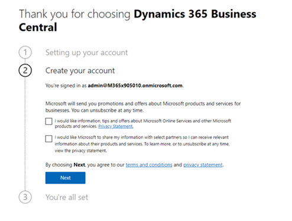
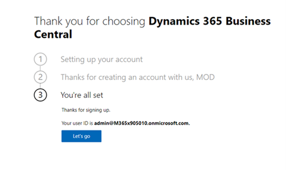

---
lab:
    title: 'Lab: Validate lab environment'
    module: 'Module 0: Course introduction'
---

Module 0: Course introduction
========================

## Practice Lab - Validate lab environment 

--------

In this Module 0 lab, you will validate that your classroom tenant is working as expected. You will access your individual credentials, record your “alias”, and open the Dynamics 365 model-driven application that we will be using throughout the course. 

Lab Specification Guide
-----------------------

The MB-800 course provides a set of lab instructions hosted publicly on GitHub.
These labs align with the content of certain modules within the course. In
addition to the recommended schedule in this guide, you will find placeholder
slides in the Instructor PowerPoint decks for each lab. Based on timing
necessities or your own teaching preferences, you may choose to move these
slides to different parts of the course and teach the labs at different points.

Lab Credentials

Almost all steps in the labs are performed in the CE + E5 tenants that learners
acquire through the lab hosting agent. Since the labs are tenant-based and those
tenants update each month, it is possible that some of the lab instructions
become out of sync with the updated tenant. While we try to update the lab
instructions regularly, be aware of this possibility.

Each student should be supplied with the following through the hosting agent:

-   A blank virtual machine (if they choose to, they can forgo the virtual
    machine after acquiring the credentials and work in a browser on their local
    machine)

-   A D365 credential, which they will use to access Business Central

Students should record these credentials upon their receipt and continue using
the same credentials throughout the duration of the course.

Lab Setup

**You must perform these steps prior to the class for Business Central to be
loaded on your tenant**.

To load Business Central on your tenant:

1.  Log into your tenant as the admin

2.  Go to
    [https://signup.microsoft.com/signup?sku=6a4a1628-9b9a-424d-bed5-4118f0ede3fd&ru=https%3A%2F%2Fbusinesscentral.dynamics.com%2F%3FredirectedFromSignup%3D1](https://nam06.safelinks.protection.outlook.com/?url=https%3A%2F%2Fsignup.microsoft.com%2Fsignup%3Fsku%3D6a4a1628-9b9a-424d-bed5-4118f0ede3fd%26ru%3Dhttps%253A%252F%252Fbusinesscentral.dynamics.com%252F%253FredirectedFromSignup%253D1&data=04%7C01%7Chakimm%40microsoft.com%7C21f26d6954b74f87cbca08d8a11af9a5%7C72f988bf86f141af91ab2d7cd011db47%7C1%7C0%7C637436484516895811%7CUnknown%7CTWFpbGZsb3d8eyJWIjoiMC4wLjAwMDAiLCJQIjoiV2luMzIiLCJBTiI6Ik1haWwiLCJXVCI6Mn0%3D%7C1000&sdata=b493hDrLlqsO1XFavus8uGimsNfTkT4Shs4ENmQ9AA0%3D&reserved=0)

3.  Click ‘Next’

1.  Click ‘Let’s Go’:

1.  You will be directed to Business Central

2.  Business Central will load for a few minutes and then you will have access
    to Business Central

