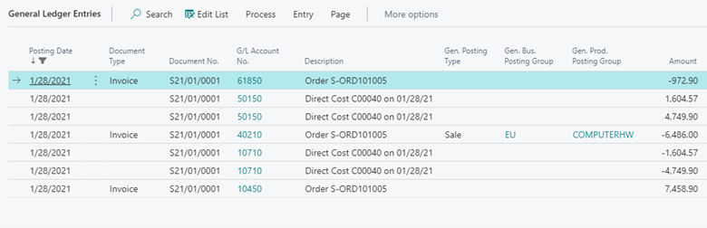

---
lab:
    title: 'Lab: Process Purchase'
    module: 'Module 5: Operations'
---

Hands-on-Lab 5.1: Process Purchase
==================================

Exercise 1: Complete the vendor card
------------------------------------

### Scenario

As the functional consultant, you are collecting more information about the
purchase process, and more particularly about the vendors who you are purchasing
from and the conditions surrounding ordering and delivering of the purchased
items.

In order to supply the brand-new European warehouse and to deliver the computer
hardware items to the European customers, these items are purchased from
European wholesalers. Some of these vendors have different sales points
throughout the country.

Vendor Cronus Cardoxy Sales is Contoso’s main supplier for all computer hardware
items. They have different locations from where to order:

-   Computers and monitors need to be ordered at the following location:

    Nyborgvej 566, DK-5000 ODENSE C – contact: Hr. Allan Vinther-Wahl

-   Other computer accessories are sold from another location:

    Havnevej 6, DK-4600 KOGE – contact: Fr. Karen Friske

Cronus Cardoxy Sales guarantees to deliver all goods within 5 days, according to
the ‘cost and freight’ shipment method.

### Tasks

1.  Create an order address for the vendor

2.  Specify receiving information

### Steps

1.  Create an order address for the vendor

    1.  On the **Vendors** list page, select vendor Cronus Cardoxy Sales (V9002)
        .

    2.  To open the vendor card, select **Manage** and then select **Edit**.

    3.  In the vendor card, select **More options**, select **Related**, then select **Vendor** and then
        **Order Addresses**.

    4.  In the opened **Order Address List** page, select **New**.

    5.  In the opened order address card, fill in the following fields:

        1.  In the **Code** field, enter COMP&MON

        2.  In the **Name** field, the value ‘Cronus Cardoxy Sales’ is
            automatically filled in.

        3.  In the **Address** field, enter ‘Nyborgvej 566’.

        4.  In the **City** field, enter ‘ODENSE C’.

        5.  In the **ZIP Code** field, the value ‘DK-5000’ is automatically
            filled in.

        6.  In the **Country/Region Code** field, the value ‘DK’ is
            automatically filled in.

        7.  In the **Contact** field, enter Hr. Allan Vinther-Wahl.

    6.  Close the order address card.

    7.  In the opened **Order Address List** page, select **New**.

    8.  In the opened order address card, fill in the following fields:

        1.  In the **Code** field, enter ACCESSORIE

        2.  In the **Name** field, the value ‘Cronus Cardoxy Sales’ is
            automatically filled in.

        3.  In the **Address** field, enter ‘Havnevej 6’.

        4.  In the **City** field, enter ‘KOGE’.

        5.  In the **ZIP Code** field, the value ‘DK-4600’ is automatically
            filled in.

        6.  In the **Country/Region Code** field, the value ‘DK’ is
            automatically filled in.

        7.  In the **Contact** field, enter Fr. Karen Friske.

    9.  Close the order address card.

    10. Close the **Order Address List** page.

2.  Specify receiving information

    1.  On the vendor card for vendor Cronus Cardoxy Sales, go to the
        **Receiving** FastTab.

    2.  In the **Location Code** field, enter EUROP.

    3.  In the **Shipment Method Code** field, enter CFR.

    4.  In the **Lead Time Calculation** field, enter 5D.

Exercise 2: Process a purchase from order to invoice and review the posted documents
------------------------------------------------------------------------------------

### Scenario

As the purchasing agent you are replenishing the stock for the European
warehouse. The computer monitors are currently low on stock and a purchase order
with their main vendor Cronus Cardoxy Sales is placed on January 14th, 2022. It
was agreed to always invoice in the local currency of Contoso, the US Dollar,
instead of the vendors currency (DKK) and a purchase request is sent to the
correct order address for the following items to be delivered on January 19th,
2022:

-   100 pieces of the 15” flat panel at LCY 4,999.89 a box, containing 10
    pieces.

-   50 pieces of the 17” monitor at LCY 5,348.56 a box, containing 10 pieces

The purchase request is confirmed by the vendor on January 15th, 2022 with order
confirmation OC15-479. They mention a delivery delay of a couple of days,
expecting to be able to deliver the entire order on January 22nd, 2022.

Eventually the goods are delivered with delivery note DN01-47 on January 23th,
2022 as follows:

-   11 boxes of the 15” flat panel – this is 1 box more than ordered

-   4 boxes of the 17” monitor – this is 1 box less than ordered

The purchase invoice with number 20-0747 is received by mail on January 26th,
2021 where a 5% discount is granted on the 15” monitors as a compensation for
the delivery delay. The invoice needs to be paid within 30 days.

### Tasks

1.  Change the currency code on the vendor.

2.  Create a purchase order.

3.  Receive items on the purchase order.

4.  Create a posted purchase invoice from the purchase order.

5.  Review the posted purchase receipt and invoice.

### Steps

1.  Change the currency code on the vendor.

    1.  On the **Vendors** list page, select vendor Cronus Cardoxy Sales

    2.  Select **Manage** and then select **Edit**.

    3.  On the opened vendor card, go to the **Invoicing** FastTab, and in the
        **Currency Code** field remove the value DKK and leave the field blank.

2.  Create a purchase order.

    1.  On the vendor card, select **New Document** and then select **Purchase
        Order**.

    2.  On the **General** FastTab, fill in the following fields:

        1.  In the **Document Date** and **Order Date** fields, enter 1/14/2022.

        2.  In the **Alternate Vendor Address Code** field, enter COMP&MON.

        3.  In the **Vendor Order No.** field, enter OC15-479.

    3.  On the **Invoice Details** FastTab, fill in the following fields:

        1.  In the **Requested Receipt Date** field, enter 1/19/2022.

        2.  In the **Promised Receipt Date** field, enter 1/22/2022.

    4.  On the **Lines** section, enter a new line by filling in the following
        field:

        1.  In the **Type** field, enter **Item**.

        2.  In the **No.** field, enter CHW1002 for the 15” flat panels.

        3.  In the **Location Code** field, the value EUROP is automatically
            filled in.

        4.  In the **Quantity** field, enter ‘10’.

        5.  In the **Unit of Measure Code** field, enter BOX.

        6.  In the **Direct Unit Cost Excl. Tax** field, enter ‘4,999.89’.

    5.  On the **Lines** section, enter a new line by filling in the following
        field:

        1.  In the **Type** field, enter **Item**.

        2.  In the **No.** field, enter CHW1003 for the 17” flat panels.

        3.  In the **Location Code** field, the value EUROP is automatically
            filled in.

        4.  In the **Unit of Measure Code** field, the value BOX is
            automatically filled in.

        5.  In the **Quantity** field, enter ‘5’.

        6.  In the **Direct Unit Cost Excl. Tax** field, enter ‘5,348.56’.

    6.  Select **Release**.

3.  Receive items on the purchase order.

    1.  On the **General** FastTab, fill in the following fields:

        1.  In the **Posting Date** field, enter 1/23/2022.

        2.  In the **Vendor Shipment No.** field, enter ‘DN01-47’.

    2.  On the **Lines** section, select the line for item CHW1002, and fill in
        the following fields:

        1.  In the **Over-Receipt Code** field, enter OVERRCPT10.

        2.  In the **Qty. to Receive** field, enter ‘11’.

    3.  On the **Lines** section, select the line for item CHW1003, and fill in
        the following fields:

        1.  In the **Qty. to Receive** field, enter ‘4’.

    4.  Select **Posting**, and then select **Post**.

    5.  Select the **Receive** option, and click **OK**.

4.  Create a posted purchase invoice from the purchase order.

    1.  Select **Release**, and then select **Reopen**.

    2.  On the **General** FastTab, fill in the following fields:

        1.  In the **Posting Date** field, enter 1/24/2022.

        2.  In the **Vendor Invoice No.** field, enter ‘20-0747’.

    3.  On the **Invoice Details** FastTab, in the **Payment Terms Code** field,
        enter ’30 DAYS’.

    4.  On the **Lines** section, select the line for item CHW1002, and fill in
        the following fields:

        1.  In the **Line Discount%** field, enter ‘5’.

            *(If the field is not available, use Personalization to make it
            visible in the Lines section.)*

    5.  Select **Posting**, and then select **Post**.

    6.  Select the **Invoice** option, and click **OK**.

5.  Review the posted purchase receipt and invoice.

    1.  Select **More options**, select **Related**, then select **Documents**, and then select
        **Receipts**.

    2.  In the page, select the posted purchase receipt.

    3. Select **More options, select **Actions**, and then select **Find Entries**.

    4.  Select the line for **Item Ledger Entry** and select **Show Related
        Entries**.

1.  Close the **Item Ledger Entries** page, the **Find Entries** page and the
    **Posted Purchase Receipts** page.

2.  Select **Related**, then select **Documents**, and then select **Invoices**.

3.  In the page, select the posted purchase invoice.

4.  Select **Invoice**, and then select **Find Entries**.

5.  Select the line for G/L entries and select **Show Related Entries**.

>   Afbeelding met tafel Automatisch gegenereerde beschrijving

1.  Close the **General Ledger Entries** page.

2.  Close the **Find Entries** page.

Exercise 3: Process the return of a purchase from return order to credit memo
-----------------------------------------------------------------------------

### Scenario

While putting away stock, one of the delivered boxes of the 17” monitors turns
out to be damaged. Cronus Cardoxy Sales will refund these items on return, which
is done on January 24th, 2022.

The purchase credit memo, with the same payment conditions as the invoice, and
with number 20-CN0747, is received by mail on January 31th, 2022. The correct
amount of LCY 5,348.56 a box will be repaid to Contoso.

### Tasks

1.  Create a purchase return order

2.  Ship the items

3.  Create a posted purchase credit memo from the purchase return order

### Steps

1.  Create a purchase return order.

    1.  In the **Purchase Return Orders** list page, select **New**.

    2.  On the **General** FastTab, fill in the following fields:

        1.  In the **Vendor Name** field, enter ‘V9002’.

        2.  In the **Document Date** and **Order Date** fields, enter 1/24/2022.

    3.  On the **Invoice Details** FastTab, in the **Payment Terms Code** field
        enter ‘30 DAYS’.

    4.  Select **Process**, and then select **Get Posted Document Lines to
        Reverse**…

    5.  In the opened page, fill in the following options:

        1.  Select the **Show Reversible Lines Only** checkbox

        2.  In the **Document Type Filter** field, enter the **Posted Invoices**
            option.

        3.  Select the line for item CHW1003.

        4.  Click **OK**.

    6.  On the **Lines** section on the purchase return order, change the
        **Quantity** field to the value ‘1’.

    7.  Select **Release**.

2.  Ship the items.

    1.  On the **General** FastTab, fill in the following fields:

        1.  In the **Posting Date** field, enter 1/24/2022.

    2.  Select **Posting**, and then select **Post**.

    3.  Select the **Ship** option and click **OK**.

3.  Create a posted purchase credit memo from the purchase return order.

    1.  On the **General** FastTab, fill in the following fields:

        1.  In the **Posting Date** field, enter 1/31/2022.

        2.  In the **Vendor Cr. Memo No.** field, enter ‘20-CN0747’.

    2.  Select **Posting**, and then select **Post**.

    3.  Select the **Invoice** option and click **OK**.

    4.  Click **No** to opening the posted purchase credit memo.

Exercise 4: Configure and process recurring purchase lines
----------------------------------------------------------

### Scenario

Next to the suppliers of trading goods, Contoso also has a numerous amount of
other costs. Often on a monthly recurring basis, the same purchase invoices need
to be processed.

To reduce the processing time, you explain the configuration of ‘recurring
purchase lines’ and together with the accounting manager, you set up the
following example:

Contoso has to pay a ‘health& dental insurance’ for each employee at the
company. They receive a monthly invoice with a fixed amount. These costs need to
be processed per department, as follows:

-   The total amount of the invoice is CAD 1,200.00, which is processed on the
    61000 income statement account.

-   25% of the cost is for the sales department.

-   35% of the cost is for the administration department.

-   40% of the cost is for the production department.

You need to set up the recurring purchase lines for vendor OakvilleWorld
(V9007), so that these lines are automatically filled in when creating a new
purchase invoice.

The accounting department at Contoso then receives a cost invoice from vendor
OakvilleWorld, with an invoice date 1/31/2022 and invoice number OW-21-M2458.
The invoice needs to be paid within 15 days.

You need to process the invoice.

### Tasks

1.  Configure recurring purchase lines

2.  Process a purchase invoice using recurring purchase lines

### Steps

1.  Configure recurring purchase lines

    1.  On the **Vendors** list page, select vendor Oakville World (V9007).

    2.  Select **Related**, then **Purchases** and then select **Recurring
        Purchase Lines**.

    3.  On the opened **Recurring Purchase Lines** page, select **New**.

    4.  On the new line, fill in the following fields:

        1.  Click on the Look Up Value button in the **Code** field, and select
            **New**.

        2.  On the opened **Standard Purchase Code Card** page, fill in the
            following fields:

            1.  In the **Code** field, enter INSURANCE

            2.  In the **Description** field, enter ‘Monthly health insurance’

            3.  In the **Currency Code** field, enter CAD.

            4.  In the **Lines** section, create a new line, and fill in the
                following fields:

                1.  In the **Type** field, select the ‘G/L Account’ option.

                2.  In the **No.** field, enter 61000.

                3.  In the **Quantity** field, enter 1.

                4.  In the **Amount excl. Tax** field, enter ‘300’. (25% of
                    1,200.00)

                    *(Make this field visible by using Personalization.)*

                5.  In the **Department Code** field, enter SALES.

            5.  In the **Lines** section, create a new line, and fill in the
                following fields:

                6.  In the **Type** field, select the ‘G/L Account’ option.

                7.  In the **No.** field, enter 61000.

                8.  In the **Quantity** field, enter 1.

                9.  In the **Amount excl. Tax** field, enter ‘420’. (35% of
                    1,200.00)

                10. In the **Department Code** field, enter ADM.

            6.  In the **Lines** section, create a new line, and fill in the
                following fields:

                11. In the **Type** field, select the ‘G/L Account’ option.

                12. In the **No.** field, enter 61000.

                13. In the **Quantity** field, enter 1.

                14. In the **Amount excl. Tax** field, enter ‘480’. (40% of
                    1,200.00)

                15. In the **Department Code** field, enter PROD.

            7.  Click **OK** to close the **Standard Purchase Code Card** page.

        3.  The new code is now automatically filled in in the **Code** field on
            the **Recurring Purchase Lines** page.

        4.  In the **Insert Rec. Lines On Invoices** field, select the
            **Automatic** option.

    5.  Close the **Recurring Purchase Lines** page

2.  Process a purchase invoice using recurring purchase lines

    1.  In the **Purchase Invoices** list page, select **New**.

    2.  On the **General** FastTab, fill in the following fields:

        1.  In the **Vendor Name** field, enter ‘V9007’.

        2.  In the **Posting Date** field, enter 1/31/2022.

        3.  Click **OK** to confirm the warning concerning the affect on the
            exchange rate.

        4.  In the **Vendor Invoice No.** field, enter OW-21-M2458.

    3.  On the **Invoice Details** FastTab, in the **Payment Terms Code** field
        enter ‘15 DAYS’.

    4.  On the **Lines** section, the invoice lines for the health insurance per
        department are automatically filled in.

    5.  Select **Posting** and then select **Post**.

    6.  Click **Yes** to post.

    7.  Click **No** to opening the posted invoice.
